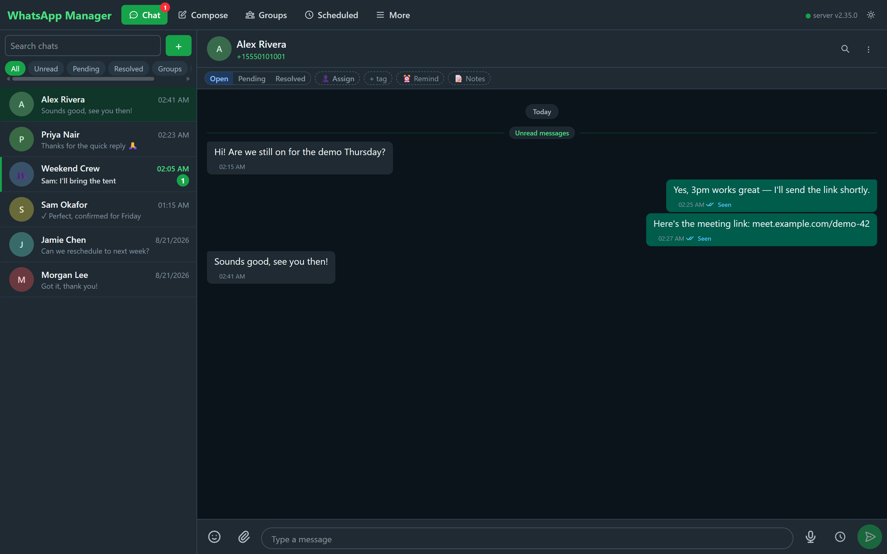
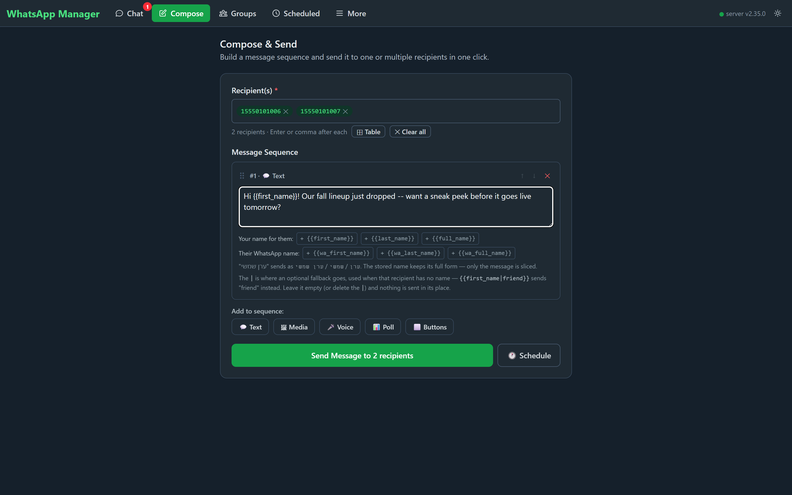
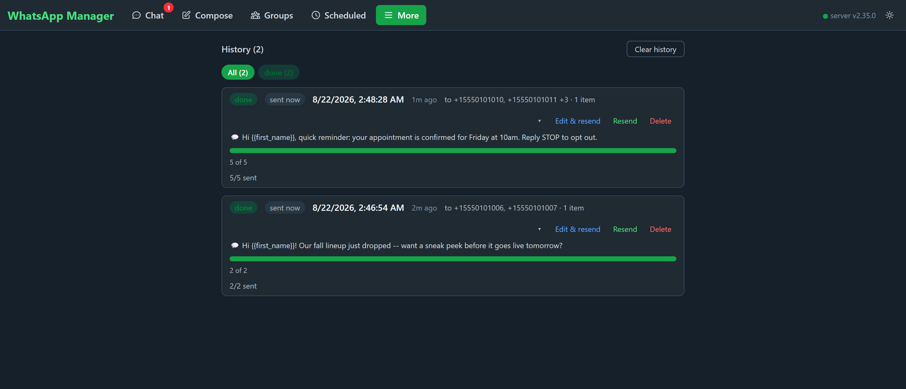
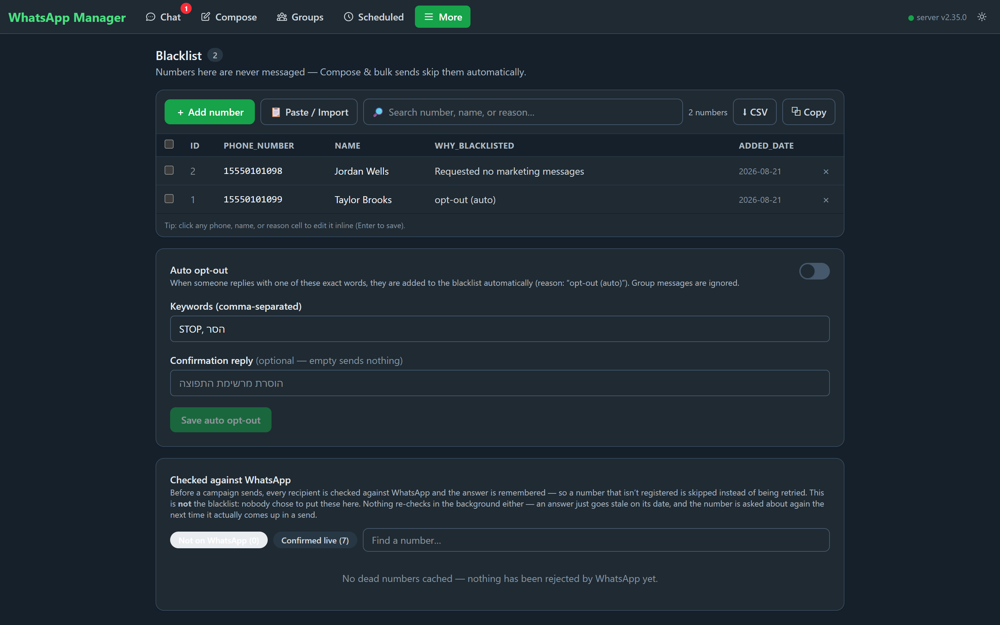
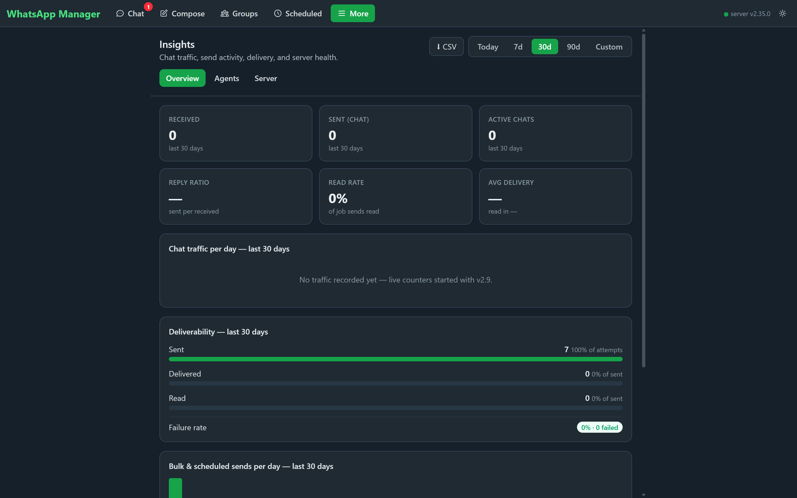

# webchat

A self-hosted WhatsApp manager on top of the [Evolution API](https://doc.evolution-api.com/):
a shared team inbox, bulk/scheduled sending with real campaign controls, and the guardrails
(blacklist, opt-out, number verification) that keep bulk sending from turning into spam. You
run it on your own server, against your own Evolution instance — no message ever passes
through a third party.

Monorepo with two workspaces:

- **[backend/](backend)** — Node + Fastify + SQLite. Typed Evolution gateway (the API key never reaches the browser), SSE event relay, scheduler with a **resumable per-recipient send ledger**, blacklist enforced on every send.
- **[frontend/](frontend)** — React + Vite + TypeScript + Tailwind. Talks only to `/api`.

See [ARCHITECTURE.md](ARCHITECTURE.md) for the design and current status, and
[deploy/README.md](deploy/README.md) for the production deploy procedure.

## Features

- 💬 **Team inbox.** Every WhatsApp line lands in one shared, real-time chat view — open/pending/resolved
  status, assignment, tags, per-chat notes and reminders, and unread badges that stay accurate even
  across WhatsApp's `@lid`/phone-number aliasing quirks.
- ✍️ **Compose & bulk send.** Build a sequence of text, media, voice notes, polls, or buttons, personalize
  it with `{{first_name}}` / `{{wa_full_name}}`-style placeholders (with fallbacks), and send it to one
  recipient or a few thousand — pasted straight from Excel if that's where your list lives.
- 🎯 **Real campaign controls, not fire-and-forget.** Bulk jobs run through a **resumable, per-recipient
  send ledger** — pause a running campaign and continue later, edit the not-yet-sent portion mid-run,
  set a sending window ("stop at 9pm, resume at 9am") or batch pacing, and watch live progress/ETA
  computed straight from the ledger. A crash or restart resumes exactly where it left off; nobody is
  ever messaged twice.
- 🚫 **Blacklist & opt-out, enforced at the one send choke point.** Add numbers by hand, paste/import a
  list, or let a configurable auto-opt-out keyword ("STOP", "הסר", …) blacklist someone the moment
  they reply — every compose/bulk/scheduled send checks it first.
- ✅ **WhatsApp number verification**, cached separately from the blacklist, so a campaign quietly skips
  numbers already known dead instead of burning retries on them — checked in the background, never
  gating the send.
- 🌱 **Cold-contact pacing.** First-touch outreach to strangers is rationed on a rolling daily budget that
  warms up gradually, so a big list can't turn into a spam blast; anyone you already have a
  conversation with is unaffected.
- 📋 **Recipient lists, quick replies, and groups** for saved audiences and canned responses, plus a
  broadcast flow for WhatsApp groups.
- 📊 **Insights dashboard.** Chat traffic, deliverability (sent/delivered/read/failed), campaign volume,
  and per-agent activity, with CSV export.
- 👥 **Multi-instance, multi-agent.** One deployment can front several WhatsApp lines with per-agent
  access grants, and an admin/agent permission model for who can send, configure, or see analytics.
- 🔒 **Everything server-side.** The Evolution API key and base URL never reach the browser — the
  frontend talks only to this server's own `/api`.

## Screenshots

*(All screenshots below are from a local demo instance with entirely fictional contacts and messages —
no real conversations or phone numbers.)*

**Team inbox**


**Compose & bulk send**


**Campaign history & progress**


**Blacklist & opt-out**


**Insights**


## Development

```bash
npm ci
npm run dev:backend    # API on :8080 (set EVOLUTION_* env to connect a real instance)
npm run dev:frontend   # vite on :5173, proxies /api → :8080
```

Backend tests and checks:

```bash
npm test               # vitest — in-memory SQLite, faked Evolution API
npm run typecheck      # both workspaces
npm run build          # both workspaces
```

## Production

```bash
cp .env.example .env   # fill in your Evolution API details
docker compose up -d --build
```

One container: the backend serves the API and the built frontend on `:8080`. `./data` is bind-mounted and holds the SQLite database.

## Configuration

Everything is environment variables — see [.env.example](.env.example). Highlights:

| Variable | Default | Purpose |
| --- | --- | --- |
| `EVOLUTION_BASE` / `EVOLUTION_INSTANCE` / `EVOLUTION_APIKEY` | — | Evolution API connection (server-side only) |
| `API_TOKEN` | *(empty)* | When set, `/api/*` requires it (`X-Api-Token`, `Bearer`, or `?token=` for SSE). Leave empty behind an authenticating proxy. |
| `EVENTS_ENABLED` | `true` | Relay Evolution websocket events via `GET /api/events` (SSE) |
| `TZ` | `Asia/Jerusalem` (compose) | Zone for every clock time the server acts on — quiet hours, a campaign's sending window. Unset in a container = UTC |
| `DELAY_MIN` / `DELAY_MAX` | `1` / `3` | Random pacing between sends, seconds. Also what a campaign's estimate is based on until it has measured its own pace |
| `SEND_MAX_ATTEMPTS` | `3` | Attempts per recipient before a send counts as failed |
| `MAX_OVERDUE_MIN` | `0` | Mark jobs more overdue than this "missed" instead of firing late |
| `RETENTION_DAYS` | `0` | Auto-purge finished jobs/attributions older than this (0 = off; also a Settings field) |

## API

- `GET /api/health` · `GET /api/config`
- `GET/POST /api/jobs`, `GET /api/jobs/:id/sends` (ledger) · `/sends/page` (one filtered page) · `/progress` (campaign state from the ledger), `POST /api/jobs/:id/cancel|restore|pause|resume|retry-failed|unsent-list`, `DELETE /api/jobs/:id`, `POST /api/jobs/clear-done`
- `GET/POST /api/blacklist`, `PUT/DELETE /api/blacklist/:phone`, `POST /api/blacklist/delete`
- `POST /api/send` — one immediate send `{recipient, item, isGroup?}`, blacklist-checked
- `GET /api/chats` · `GET /api/contacts` · `POST /api/messages/find` · `POST /api/media` — typed Evolution gateway (all accept `?instance=`; default from Settings, enforced against per-agent grants)
- `GET /api/instances` — Evolution instances visible to the requester (admin gets storage counts)
- `GET /api/maintenance` · `POST /api/maintenance/cleanup` — storage telemetry + retention cleanup (admin)
- `GET /api/events` — SSE stream of Evolution events (filtered per connection by instance grants)
